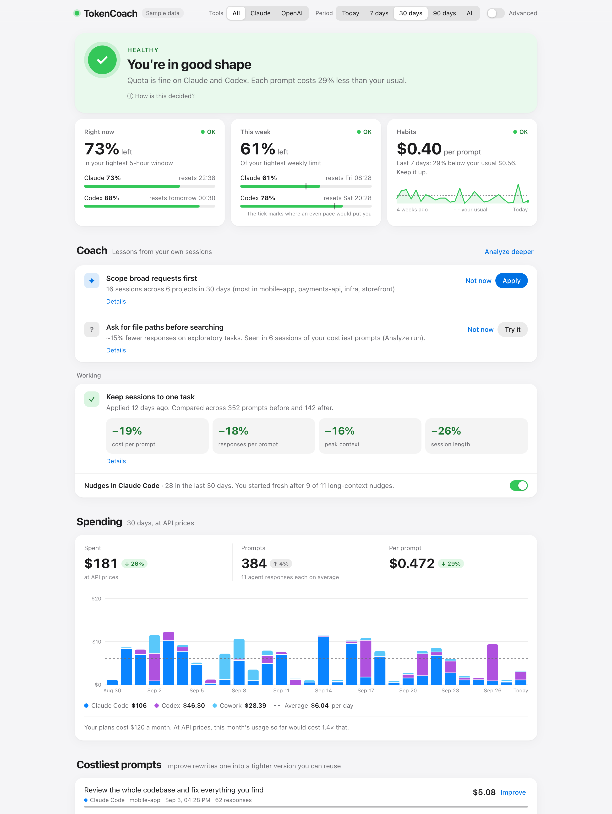
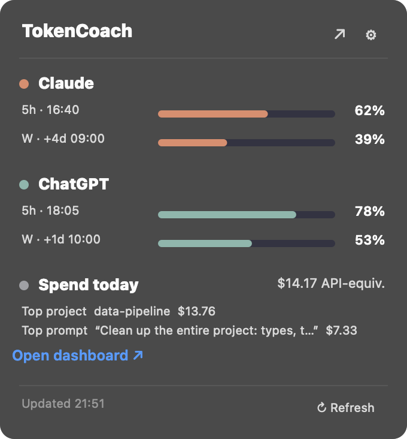
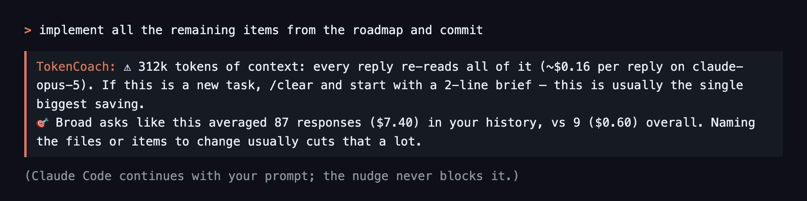
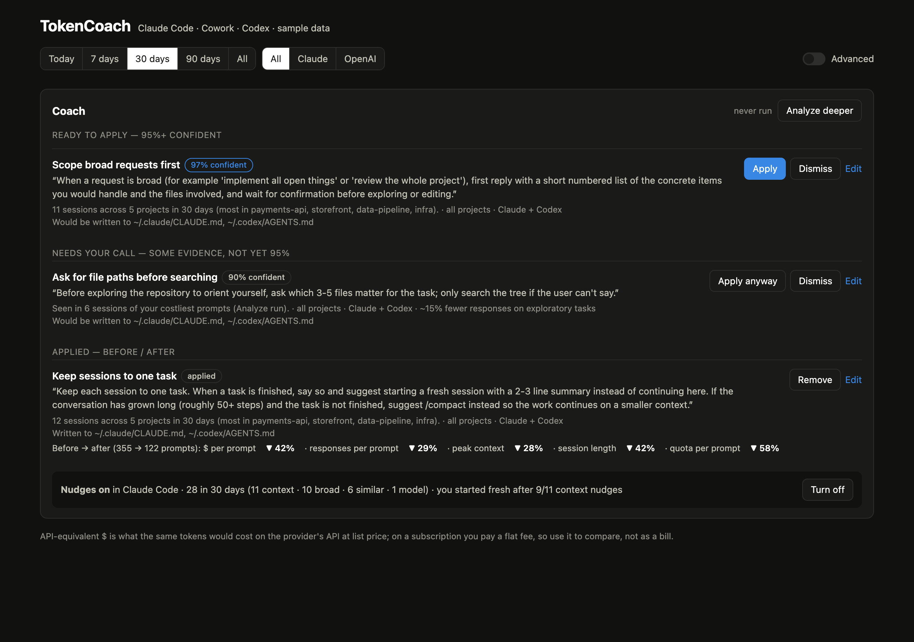
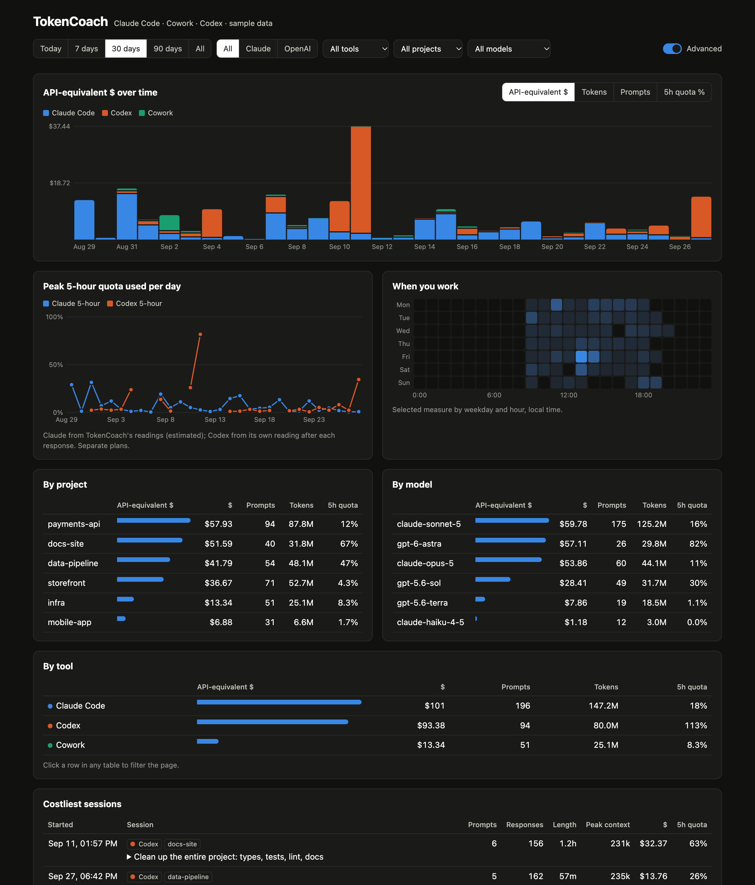

# TokenCoach

**See what every Claude and ChatGPT prompt really costs, and get coached to spend less
for the same results.** A macOS menu bar app for people who live in Claude Code and Codex.

[](#install)
[](LICENSE)
[](#privacy)

<picture>
  <source media="(prefers-color-scheme: dark)" srcset="docs/images/dashboard-dark.png">
  
</picture>

<sub>All screenshots use the built-in sample data (`tokencoach --demo`).</sub>

---

## The problem you can't see

A $20–200 subscription feels flat, until you hit the 5-hour limit at 3pm. The cause is rarely
one big question. It's habits that stay invisible:

- **Long sessions.** Every reply re-reads the whole conversation. At 300k tokens of context,
  "one more small thing" costs more than the original task.
- **Broad asks.** "Implement all the open things" sends an agent on a 100-step tour of your
  repository before it writes a line.
- **The wrong model.** A quick question to the most expensive model, because it was selected.

TokenCoach turns those habits into numbers, then helps you change them, and shows whether it worked.

## How it works: measure → nudge → coach → prove

### 1. Measure: every prompt, every token, every project



TokenCoach reads the transcripts that **Claude Code, Cowork and Codex** already write on your
Mac and keeps a local ledger: one row per prompt, with tokens, model, project, what it would
cost at API prices, and how much of your 5-hour quota it used.

The menu bar shows the quota you have **left** for Claude and ChatGPT, today's spend, and your
most expensive prompt. **Open dashboard** shows everything by day, project, model and tool,
with an **All / Claude / OpenAI** switch and an **Advanced** mode for the deep dive.

<br clear="right">

### 2. Nudge: a heads-up before an expensive prompt runs



A Claude Code hook adds a one-line tip at the moment it matters, based on *your own* history:
a session re-reading 300k tokens per reply, a broad ask that historically ran 10× longer, a
quick question on your priciest model, a prompt similar to one that cost $9 last week, or a
nearly empty quota. It never blocks or rewrites what you typed.

### 3. Coach: lessons written into the files your agents read



Patterns that repeat across sessions become **lessons**, plain instructions for your coding
agent such as *"when a request is broad, list the concrete items and wait for confirmation"*.

- **Evidence decides.** Confidence is capped by how many separate sessions show the pattern.
  At **95%+** one click writes the lesson into `CLAUDE.md` / `AGENTS.md`. Between 70% and 95%
  you review it and decide. Below that it keeps collecting.
- **Your words win.** **Edit** any lesson ("warn after 10 responses, not 30"). Edited lessons
  are yours, and later analyses never overwrite them.
- **Safe edits.** Lessons live in one clearly marked block, the original file is backed up
  first, and **Remove** takes them out again.
- **Improve any prompt.** Get a tighter rewrite of a costly prompt to copy or save as a template.
- **Analyze deeper.** Claude reviews your 20 costliest prompts and proposes new lessons.

### 4. Prove: before and after

Every applied lesson shows what changed afterwards: $ per prompt, agent responses per
prompt, session length, peak context and quota per prompt. So you know which habits paid off.

<details>
<summary><b>Advanced view</b>: quota over time, when you work, breakdowns, sessions</summary>
<br>

</details>

---

## Install

**One line** (recommended; also sets up start-at-login and the optional desktop widget):
```bash
curl -fsSL https://raw.githubusercontent.com/cagdasatici/TokenCoach/main/install.sh | bash
```

**Homebrew:**
```bash
brew tap cagdasatici/tokencoach https://github.com/cagdasatici/TokenCoach
brew install tokencoach
tokencoach &          # first run adds it to your login items
```

**Just look first.** The demo uses sample data and doesn't read or change anything of yours:
```bash
git clone https://github.com/cagdasatici/TokenCoach && cd TokenCoach
python3 -m venv .venv && .venv/bin/pip install -r requirements.txt
.venv/bin/python tokencoach.py --demo
```

Requirements: macOS 12+, Python 3.10+. Claude Code and/or Codex for per-prompt tracking;
a claude.ai or chatgpt.com login in your browser for the quota-left bars. The desktop widget
needs Xcode (the installer builds it when Xcode is present).

**Uninstall:** `bash ~/.tokencoach/uninstall.sh` (add `--purge` to delete your data too).

**Upgrading from AIQuotaBar or AIQuotaLeft:** run the one-line installer above. It stops the
old launch agents, watchdog and widget, moves your settings and quota history into TokenCoach,
and removes the old `~/.ai-quota-bar` folder. Your data is kept. AIQuotaLeft installs that
auto-update make this move by themselves on their next start.

---

## What the numbers mean

| | Claude Code / Cowork | Codex | claude.ai / chatgpt.com chats |
|---|---|---|---|
| Tokens per prompt | exact, from local transcripts | exact, from local transcripts | estimated from an imported data export |
| API-equivalent $ | Anthropic list prices | OpenAI list prices¹ | not priced |
| Quota per prompt | estimated from TokenCoach's quota readings | from Codex's own reading after each response | — |

**API-equivalent $** is what the same tokens would cost on the provider's API. On a
subscription you pay a flat fee, so treat it as a yardstick for comparing prompts, projects and
models, not as a bill. **Set Plan Prices…** in the menu shows what your plan is worth against it.

¹ Standard-tier prices from OpenAI's pricing page (checked 2026-09-27), including long-context
rates above 272K tokens. A model without a published price (e.g. `codex-auto-review`) is priced
like its closest published sibling and labelled *estimated*. Override anything in
`~/Library/Application Support/TokenCoach/config.json`:

```json
{
  "ledger_prices": {"gpt-6-astra": {"in": 10, "read": 1, "out": 50}},
  "ledger_model_equivalents": {"codex-auto-review": "gpt-5.6-luna"},
  "ledger_plans": {"claude": 100, "chatgpt": 20}
}
```

## Privacy

- **Everything stays on your Mac.** The ledger is a local SQLite file; the dashboard is served
  only on `127.0.0.1`, behind a per-install key.
- **What is read:** Claude Code transcripts (`~/.claude/projects`), Cowork logs, Codex sessions
  (`~/.codex/sessions`), and, for the quota bars, your claude.ai / chatgpt.com session cookies
  from your browser (macOS may ask for Keychain access once). Cookies are only ever sent to
  claude.ai / chatgpt.com.
- **What leaves, and only when you click:** **Analyze deeper** and **Improve** send a digest of
  your costliest prompts (or the one prompt) to Claude through *your own* `claude` CLI, running
  Sonnet 5 with all tools off. That counts against your Claude plan like any Claude Code prompt,
  typically $0.03–0.12 API-equivalent per run, and TokenCoach tracks it like any other session.
- **What changes on your Mac:** a login agent, a small watchdog that restarts the app if it
  dies, the Claude Code hook (a backup of `~/.claude/settings.json` is written first, and you
  can turn nudges off in the menu), and lesson blocks you choose to apply. The uninstaller
  removes all of it.

## Troubleshooting

- **No ◆ in the menu bar:** `tail -50 ~/Library/Logs/TokenCoach/tokencoach.log`, then
  `bash ~/.tokencoach/tokencoach-doctor.sh` checks and repairs the moving parts.
- **Quota bars empty:** log in at claude.ai / chatgpt.com in your browser, then
  **Auto-detect from Browser** in the ⚙ menu.
- **Dashboard buttons do nothing:** open it from the menu bar icon; a saved copy is read-only.
- **Command line:** `tokencoach --help` with Homebrew, otherwise
  `~/.tokencoach/.venv/bin/python ~/.tokencoach/tokencoach.py --help` (`--ledger`, `--dashboard`,
  `--optimize`, `--import-export FILE`, `--demo`).

## Credits

TokenCoach is built on **[AIQuotaBar](https://github.com/yagcioglutoprak/AIQuotaBar)** by
[Toprak Yagcioglu](https://github.com/yagcioglutoprak). The menu bar app, the quota fetching
for claude.ai and ChatGPT, and the desktop widget all started there. TokenCoach adds the ledger,
dashboard, nudges, coaching and before/after measurement. If you like the menu bar part,
please star the original too.

## License

[MIT](LICENSE). Copyright © 2026 Toprak Yagcioglu (AIQuotaBar) and the TokenCoach contributors.

Not affiliated with or endorsed by Anthropic or OpenAI. The quota bars use the same private
usage endpoints as the providers' own settings pages, and may break when those change.
