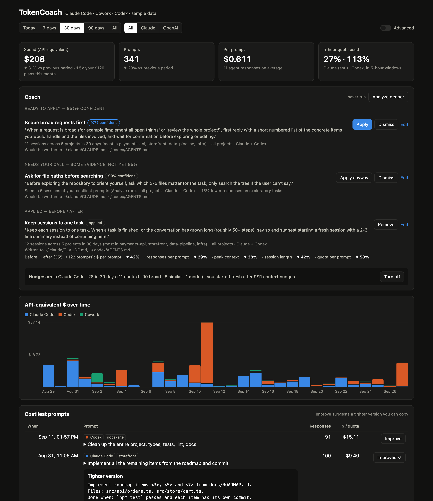

# TokenCoach: a one-minute sample-data walkthrough

Prepared 2026-10-05 for the v1.2.0 sharing draft. This shows development-channel
features; Homebrew v1.1.0 does not include all of them. Release acceptance and the
signed, notarized DMG are still pending.

**Sample data throughout.** All prompts, projects, quota readings, costs and
before/after changes below are synthetic. They illustrate the interface, not results
from users or evidence that TokenCoach saves money.

## 0:00–0:20 — See quota left and spot costly habits

TokenCoach is a macOS menu bar app for people using Claude Code, Cowork or Codex.
Open its dashboard to see quota **remaining**, a health summary and API-equivalent
cost per prompt. Switch between All, Claude and OpenAI, or change the date range to
inspect the activity you care about.

**Sample data:** the green state and lower cost shown here are made-up readings.
Dollar amounts compare token use at API prices; they are not subscription charges.
Claude quota per prompt is estimated; missing measurements mean unknown, not zero.

## 0:20–0:45 — Review a lesson and investigate what changed

The Coach section suggests instructions based on recurring habits, such as keeping
sessions to one task. Inspect the evidence, edit the wording and decide whether to
apply a lesson to the managed block in `CLAUDE.md` or `AGENTS.md`. The original file
is backed up, and you can remove the lesson later.

**Sample data:** every before/after percentage and yield value in this image is
synthetic. With your own history, dates and sample sizes help you investigate changes
after applying a lesson. An observed change does not establish that coaching caused
it. No measured savings are claimed.

## 0:45–1:00 — Choose how to try it

Local transcript tracking works without browser-cookie access. Claude Code can get
prompt nudges; Codex gets coaching through `AGENTS.md` lessons and has no prompt
nudge hook. Analyze deeper and Improve send prompt content to Claude through your
own CLI only when you click them. Quota endpoints can change or become unavailable.

[Choose an installation route or run the sample-data demo](https://github.com/cagdasatici/TokenCoach#install).
Current source routes require macOS 12+ and Python 3.10+; the optional widget needs
macOS 14+ and Xcode. The installation page distinguishes stable Homebrew v1.1.0
from moving signed `main`; a DMG is planned, not available yet.

Built on AIQuotaBar by Toprak Yagcioglu. TokenCoach is not affiliated with or endorsed
by Anthropic or OpenAI.

## Production notes for the sharing draft

Reuse the existing TokenCoach name, diamond menu icon and dashboard styling.
The two unmodified images above are the existing README sample-data assets, produced
through `tokencoach.py --screenshots docs/images` using `tokencoach/demo.py`.
Their visible “Sample data” badges were checked on 2026-10-05. Keep those badges and
these captions visible; do not crop them out or present a before/after tile alone.
Do not record the owner's live app, browser, prompts or account data.

For a recording, use the three timed sections above as narration and keep a
“Sample data — illustrative, no measured savings” label visible throughout.
If refreshing assets, use only the screenshot command above in a separate demo
process. Review every resulting image before replacing existing assets.

Before posting, recheck release status and platform requirements against accepted
artifacts and the installation page. Broad announcement awaits the release gates in
[the sharing checklist](../plans/2026-10-05-public-sharing-readiness.md).
This walkthrough is prepared material; no recording or public posting is claimed.
